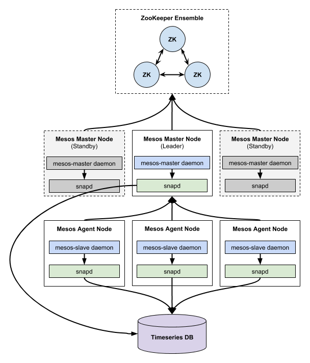

# Snap Collector Plugin — Apache Mesos

[](https://travis-ci.org/intelsdi-x/snap-plugin-collector-mesos)
[](https://goreportcard.com/report/github.com/intelsdi-x/snap-plugin-collector-mesos)

This Snap plugin collects metrics from an [Apache Mesos][mesos-home] cluster.
It gathers information about cluster resource allocation and utilization, as
well as metrics about running containers.

1. [Getting Started](#getting-started)
    * [System Requirements](#system-requirements)
    * [Installation](#installation)
    * [Configuration and Usage](#configuration-and-usage)
2. [Documentation](#documentation)
    * [Collected Metrics](#collected-metrics)
    * [Examples](#examples)
    * [Known Issues and Caveats](#known-issues-and-caveats)
    * [Roadmap](#roadmap)
3. [Community Support](#community-support)
4. [Contributing](#contributing)
5. [License](#license)
6. [Acknowledgements](#acknowledgements)

## Getting Started
### System Requirements
At a minimum, you'll need:
  * [Apache Mesos][mesos-home] (currently tested against 0.26.x, 0.27.x, and 0.28.x)
  * [Golang 1.5+][golang-dl] (only needed for building the plugin)
  * [Snap][snap-github] v0.14+
  * Linux (amd64)
  * InfluxDB and the [InfluxDB publisher for Snap][snap-influxdb] v13+ (optional)
  * Mac OS X (x86_64) (for development/testing only)

To enable metrics collection from the `perf_event` cgroups subsystem, you'll also need a kernel that supports it,
and the userland tools that enable you to run the `perf` command. On Ubuntu, this includes the following packages:
  * `linux-tools-common`
  * `linux-tools-generic`
  * `linux-tools-$(uname -r)`

*Note: see the [Caveats](#known-issues-and-caveats) section below for known issues with Mesos and the
`cgroups/perf_event` isolator.*

### Installation
#### Download the Mesos plugin binary
You can download pre-built binaries for Linux x64 from this plugin's [GitHub Releases][releases] page.

#### Building the plugin from source
Clone this GitHub repository:

```
$ git clone https://github.com/intelsdi-x/snap-plugin-collector-mesos
$ cd snap-plugin-collector-mesos
```

Build the plugin by running `make`:

```
$ make
```

After compilation has finished, the binary will be available in `build/rootfs/snap-plugin-collector-mesos`

### Configuration and Usage
First, be sure that you've familiarized yourself with the Snap framework by reading the
[Getting Started documentation][snap-getting-started].

To specify the hostname or IP address and port that this plugin should connect to, add the following to the Snap
global configuration, in the `collector` object:

```
    "mesos": {
      "all": {
        "master": "10.180.10.180:5050",
        "agent": "10.180.10.180:5051"
      }
    }
```

Typically, you should only need to provide a value for `master` _or_ `agent`, unless you're running the master and agent
on the same machine (e.g. in development). This plugin will automatically determine which service(s) you provided a
host/port combination for and collect metrics from the master and/or the agent.

Snap and this plugin should then be deployed to each machine in the Mesos cluster. This allows collection to happen as
close to the agent as possible.



When monitoring the Mesos masters, the plugin queries the local Mesos master to determine if it's currently the leader.
If it is, metrics collection will occur normally. If the local master is not currently the leader, a message will be
recorded to the plugin log, and metrics collection will not happen on that machine.

Once Snap is configured and this plugin is loaded, you'll be able to start collecting metrics from the Mesos cluster.
For examples on how to do this, see the [Examples](#examples) section below.

## Documentation
Mesos is a complex system and its installation and administration is outside the scope of this README. There are a few
resources you might want to consider taking a look at to get started with Mesos:
  * [Apache Mesos "Getting Started" documentation][mesos-getting-started]
  * [Mesosphere Downloads][mesosphere-downloads]
  * [scripts/provision-travis.sh](scripts/provision-travis.sh)

Design documents and RFCs pertaining to this plugin are tracked via the ["RFC" label in GitHub Issues][github-rfc].

Also, you may want to consider checking out the following tests to understand how this plugin works:
  * [Master unit tests](mesos/master/master_test.go)
  * [Agent unit tests](mesos/agent/agent_test.go)
  * [Plugin integration tests](mesos/mesos_integration_test.go)

### Collected Metrics
This plugin collects hundreds of metrics from Mesos masters and agents. As such, there are too many to list them all
here, so instead we've provided a quick overview. To get a complete list of available metrics, you can run the
following commands:
```
$ snapctl plugin load snap-plugin-collector-mesos
$ snapctl metric list
```

#### Mesos framework metrics
At the highest (per-cluster) level, this plugin returns select metrics from the `/master/frameworks` API endpoint on
the leading Mesos master. Specifically, we collect the following metrics on a per-framework basis:

  * Offered CPUs, memory, and disk
  * Allocated CPUs, memory, and disk
  * Used CPUs, memory, and disk


#### Mesos master/agent metrics
This plugin returns all available metrics from the `/metrics/snapshot` API endpoint on Mesos masters and agents.
A few of the available metrics that are collected include:

Masters:
  * `master/cpus_total` and `master/cpus_used`
  * `master/disk_total` and `master/disk_used`
  * `master/mem_total` and `master/mem_used`
  * `master/slaves_active`
  * `master/tasks_running`
  * `registrar/state_store_ms/p90`, `registrar/state_store_ms/min`, `registrar/state_store_ms/max`
  * `system/load_1min`, `system/load_5min`, `system/load_15min`

Agents:
  * `slave/tasks_running` and `slave/tasks_failed`
  * `slave/cpus_total` and `slave/cpus_used`
  * `slave/disk_total` and `slave/disk_used`
  * `slave/mem_total` and `slave/mem_used`
  * `slave/executors_running`
  * `system/load_1min`, `system/load_5min`, `system/load_15min`

For a complete reference, please consult the [official Mesos documentation][mesos-monitoring].

#### Mesos monitoring statistics (executor/container metrics)
This plugin returns most of the available metrics from the `/monitor/statistics` API endpoint on the Mesos agent,
which includes metrics about running executors (containers) on a specific Mesos agent. The metrics available via this
endpoint largely depend on the features enabled in Mesos. There are far too many metrics to list here, so instead we
provide links to the code that describes the structure.

*Note: the available metrics are defined in the mesos.proto protobuf, which has been compiled to Golang for the purposes
of this plugin. More information is available in [GitHub issue #11][github-issue-11].*

  * The base [`ResourceStatistics` struct][resourcestatistics-struct] is provided for each running executor on the
  cluster.
  * If Mesos was built with the `--with-network-isolator` option and the `network/port_mapping` isolator is enabled,
  you'll also be able to collect [various network metrics][network-usage-info].
  * If the necessary perf-related packages are installed, Mesos is configured to use the `cgroups/perf_event`, and
  values are provided to the `--perf_events` option on the Mesos agent, you'll also be able to collect per-container
  perf metrics as defined in the [`PerfStatistics` struct][perfstatistics-struct].

#### Metric tags

Namespace                   | Tag            | Description
----------------------------|----------------|------------
`/intel/mesos/**`           | `source`       | IP and port of the Mesos master/agent that this plugin is connecting to. Depending on the network configuration of a system, the value of this tag _could_ be different than the value of the built-in `plugin_running_on` tag in Snap.
`/intel/mesos/master/*/**`  | `framework_id` | The UUID that the Mesos master assigned to a given framework.
`/intel/mesos/agent/*/*/**` | `framework_id` | The UUID that the Mesos master assigned to a given framework. Allows executors to be grouped/queried on a per-framework basis.
`/intel/mesos/agent/*/*/**` | `executor_id`  | The ID that a scheduler assigned to a specific executor (container) running on a Mesos agent.

### Examples
There are examples of the Snap global configuration and various tasks located in the [examples](examples) directory.
Specifically, these include:

  * Snap global configuration
  * Snap tasks (publish to file and publish to InfluxDB)
  * Grafana dashboard for visualizing cluster telemetry

*Note: these scenarios will work with the Vagrant development environment included in this repo. For more info on how
to get started with Vagrant, please see [CONTRIBUTING.md](CONTRIBUTING.md).*

#### Publishing metrics to a file
To start collecting Mesos metrics and publish them to a file, you'll need to perform the following steps.


Start the Snap daemon in the background:

```
$ snapd --plugin-trust 0 --log-level 1 --config examples/configs/snap-config-example.json \
    > /tmp/snap.log 2>&1 &
```

Assuming you're in the working directory for this plugin, load the Mesos collector plugin:

```
$ snapctl plugin load build/rootfs/snap-plugin-collector-mesos
```

Get the available metrics for your system:

```
$ snapctl metric list
```

Load the `passthru` processor plugin, and the `file` publisher plugin:

```
$ snapctl plugin load ${SNAP_PATH}/plugin/snap-processor-passthru
$ snapctl plugin load ${SNAP_PATH}/plugin/snap-publisher-file
```

Create a new Snap task:

```
$ snapctl task create -t examples/tasks/mesos-all-file.json
```

Stop the task:

```
$ snapctl task stop <task ID>
```

#### Visualizing cluster telemetry with Grafana and InfluxDB
To help you get up and running quickly, this repo also includes a more extensive example of how to publish Mesos cluster
metrics to InfluxDB and visualize this data with Grafana. We assume that you already have a working InfluxDB and
Grafana installation, and that you have all the necessary Snap plugins and configuration loaded.

*Note: you'll need to modify the values for the `host`, `user`, and `password` options in the example tasks.*

On the Mesos master(s), run the following command:

```
$ snapctl task create -t examples/tasks/mesos-master-influxdb.json
```

On the Mesos agent(s), run the following command:

```
$ snapctl task create -t examples/tasks/mesos-agent-influxdb.json
```

Finally, load the example Grafana dashboard. The following commands assume that Grafana is running at
http://grafana.example.com:3000 and using the default username of `admin`, and the default password of `admin`.

```
$ GRAFANA="http://grafana.example.com:3000"
$ COOKIEJAR=$(mktemp)

$ curl -sH 'Content-Type: application/json; charset=UTF-8'              \
    --data-binary '{"user": "admin", "email": "", "password": "admin"}' \
    --cookie-jar "$COOKIEJAR" "${GRAFANA}/login"

$ curl -sH 'Content-Type: application/json; charset=UTF-8' --cookie "$COOKIEJAR" \
    -d@mesos.json "${GRAFANA}/api/dashboards/db"
```

You should now see some basic metrics about your Mesos cluster:


### Known Issues and Caveats
  * Currently, the address of the Mesos master and/or agent is provided via Snap's global configuration file. When this
  plugin is loaded (using `snapctl`) it plugin will query a Mesos master and/or agent for its available metrics and use
  the resulting JSON structure to build Snap's metrics catalog. However, a configuration change on the Mesos master or
  agent could alter the metrics reported by Mesos (e.g., enabling the network isolator). Therefore, if you modify the
  configuration of a Mesos master or agent and expect more (or fewer) metrics to be collected, you should reload this
  Snap plugin at the same time.
  * Due to a bug in Mesos, the parsing logic for the `perf` command was incorrect on certain platforms and kernels. When
  the `cgroups/perf_event` isolator was enabled on an agent, the `perf` object would appear in the JSON returned by the
  agent's `/monitor/statistics` endpoint, but it would contain no data. This issue was resolved in Mesos 0.29.0, and was
  backported to Mesos 0.28.2, 0.27.3, and 0.26.2. For more information, see [MESOS-4705][mesos-4705-jira].
  * There is an ongoing effort to rename the Mesos "slave" service to "agent". As of Mesos 0.28.x, this work is still
  in progress. This plugin uses the newer "agent" terminology, but some metrics returned by Mesos may still use the
  older "slave" term. For more information, see [MESOS-1478][mesos-1478-jira].

### Roadmap
For version 2, we intend to support additional deployment options as documented in [GitHub issue #14][github-issue-14].
Otherwise, there isn't a formal roadmap for this plugin, but it's in active development. If you have a feature request,
please [open a new issue on GitHub][github-new-issue] or [submit a pull request][github-new-pull-request].

## Community Support
This repository is one of many plugins in Snap, a powerful telemetry framework. To reach out to other users in the
community, check out the full project at <http://github.com/intelsdi-x/snap>.

## Contributing
We love contributions!

There's more than one way to give back, from examples to blog posts to code updates. See our recommended process in
[CONTRIBUTING.md](CONTRIBUTING.md).

## License
[Snap][snap-github], along with this plugin, is open source software released
under the [Apache Software License, version 2.0](LICENSE).

## Acknowledgements
  * Authors: [Marcin Krolik][marcin-github], [Roger Ignazio][roger-github]


[github-issue-11]: https://github.com/intelsdi-x/snap-plugin-collector-mesos/issues/11
[github-issue-14]: https://github.com/intelsdi-x/snap-plugin-collector-mesos/issues/14
[github-new-issue]: https://github.com/intelsdi-x/snap-plugin-collector-mesos/issues/new
[github-new-pull-request]: https://github.com/intelsdi-x/snap-plugin-collector-mesos/pulls
[github-rfc]: https://github.com/intelsdi-x/snap-plugin-collector-mesos/issues?utf8=✓&q=is%3Aissue+is%3Aall+label%3ARFC+
[golang-dl]: https://golang.org/dl/
[marcin-github]: https://github.com/marcin-krolik
[mesos-1478-jira]: https://issues.apache.org/jira/browse/MESOS-1478
[mesos-4705-jira]: https://issues.apache.org/jira/browse/MESOS-4705
[mesos-home]: http://mesos.apache.org
[mesos-getting-started]: http://mesos.apache.org/gettingstarted/
[mesos-monitoring]: http://mesos.apache.org/documentation/latest/monitoring/
[mesosphere-downloads]: https://mesosphere.com/downloads/
[network-usage-info]: https://github.com/intelsdi-x/snap-plugin-collector-mesos/blob/master/mesos/mesos_pb2/mesos_pb2.go#L3141-L3149
[perfstatistics-struct]: https://github.com/intelsdi-x/snap-plugin-collector-mesos/blob/master/mesos/mesos_pb2/mesos_pb2.go#L3541-L3610
[releases]: https://github.com/intelsdi-x/snap-plugin-collector-mesos/releases
[resourcestatistics-struct]: https://github.com/intelsdi-x/snap-plugin-collector-mesos/blob/master/mesos/mesos_pb2/mesos_pb2.go#L3086-L3165
[roger-github]: https://github.com/rji
[snap-getting-started]: https://github.com/intelsdi-x/snap/blob/master/README.md#getting-started
[snap-github]: https://github.com/intelsdi-x/snap
[snap-influxdb]: https://github.com/intelsdi-x/snap-plugin-publisher-influxdb
